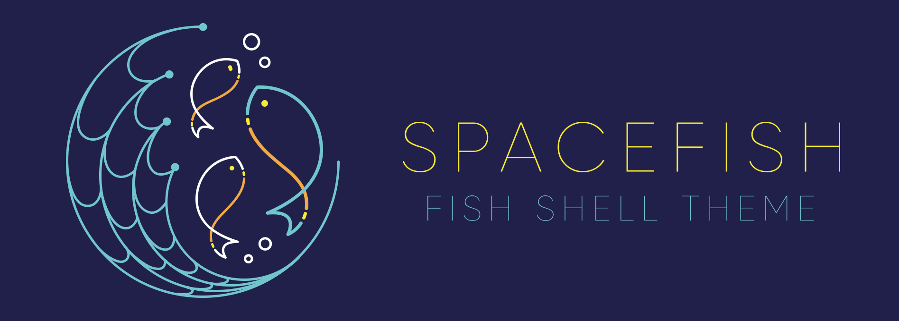

<h1 align="center">
  <a href="https://github.com/starship/starship">
    
  </a><br><br>
  <a href="https://github.com/matchai/spacefish">
    
  </a>
  <br>
  <br> Spacefish 🚀🐟 <br>
</h1>

<h4 align="center">
  <a href="https://fishshell.com" target="_blank"><code>Fish Shell</code></a> prompt for Astronauts.
</h4>

<p align="center">
  <a href="https://travis-ci.org/matchai/spacefish">
    
  </a>
  <a href="https://fishshell.com/">
  
  </a>
  <a href="https://github.com/matchai/spacefish/blob/master/LICENSE">
    
  </a>
</p>

<div align="center">
  <h4>
    <a href="https://spacefish.matchai.me/">Website</a> |
    <a href="#installation">Install</a> |
    <a href="#features">Features</a> |
    <a href="./docs/Options.md">Options</a> |
    <a href="./docs/API.md">API</a>
  </h4>
</div>

<div align="center">
  <sub>Built with ❤︎ by
  <a href="https://matchai.me">Matan Kushner</a> and
  <a href="#contributors">contributors </a></sub>
  <br>
  <sub>A port of <a href="https://github.com/denysdovhan/spaceship-prompt">Spaceship ZSH</a> by
  <a href="https://denysdovhan.com/">Denys Dovhan</a></sub>
</div>

<br>
Spacefish is a minimalistic, powerful and extremely customizable <a href="https://fishshell.com">Fish Shell</a> prompt. It combines everything you may need for convenient work, without unnecessary complications, like a real spacefish.

<p align="center"></p>
  
</p>

<sub>Vist <a href="./docs/Troubleshooting.md#why-doesnt-my-prompt-look-like-the-preview">Troubleshooting</a> for instructions to recreate this terminal setup.</sub>

## Features

* Clever hostname and username displaying.
* Indicator if user is root.
* Prompt character turns red if the last command exits with non-zero code.
* Current Git branch and rich repo status:
  * `?` — untracked changes;
  * `+` — uncommitted changes in the index;
  * `!` — unstaged changes;
  * `»` — renamed files;
  * `✘` — deleted files;
  * `$` — stashed changes;
  * `=` — unmerged changes;
  * `⇡` — ahead of remote branch;
  * `⇣` — behind of remote branch;
  * `⇕` — diverged changes.
* Indicator for jobs in the background (`✦`).
* Current Node.js version, through nvm/nodenv/n (`⬢`).
* Current Docker version and connected machine (`🐳`).
* Current Ruby version, through rvm/rbenv/chruby/asdf (`💎`).
* Current Go version (`🐹`).
* Current PHP version (`🐘`).
* Current Rust version (`𝗥`).
* Current version of Haskell GHC Compiler, defined in stack.yaml file (`λ`).
* Current Julia version (`ஃ`).
* Current Amazon Web Services (AWS) profile (`☁️`) ([Using named profiles](http://docs.aws.amazon.com/cli/latest/userguide/cli-multiple-profiles.html)).
* Current Python virtualenv.
* Current Conda version (`🅒`).
* Current Elixir Version (`💧`).
* Current Python pyenv (`🐍`).
* Current .NET SDK version, through dotnet-cli (`.NET`).
* Current Kubectl context (`☸️`).
* Package version, if there is a package in current directory (`📦`).
* Current battery level and status:
  * `⇡` - charging;
  * `⇣` - discharging;
  * `•` - fully charged.
* Current Vi-mode mode.
* Optional exit-code of last command.
* Optional time stamps 12/24hr in format.
* Execution time of the last command if it exceeds 5 seconds.

Want more features? Please [open an issue](https://github.com/matchai/spacefish/issues/new?template=Feature_request.md) or send pull request!

## Requirements

To get spacefish working correctly, you will need:

* [`fish`][fish] (v2.7.0 or newer)
* [Powerline Font](https://github.com/powerline/fonts) must be installed and enabled in your terminal.

## Installation

### [Fisher](https://github.com/jorgebucaran/fisher)

```fish
$ fisher add matchai/spacefish
```

### [Oh My Fish!](https://github.com/oh-my-fish/oh-my-fish)

```fish
$ omf install spacefish
```

## Customization

Spacefish works really well out of the box, but you can customize your fish to your heart's content!

* [**Options**](./docs/Options.md) — Tweak section's behavior with tons of options.

You have the ability to customize or disable specific elements of Spacefish. All options must be overridden in your `config.fish`.

## Troubleshooting

Having issues? Take a look at our [Troubleshooting](./docs/Troubleshooting.md) page.

Still struggling? Please [file an issue](https://github.com/matchai/spacefish/issues/new?template=Support_question.md), describe your problem, and we will gladly help you.

## Contributors

Thanks goes to these wonderful people ([emoji key](https://github.com/kentcdodds/all-contributors#emoji-key)):

<!-- ALL-CONTRIBUTORS-LIST:START - Do not remove or modify this section -->
<!-- prettier-ignore -->
<table><tr><td align="center"><a href="https://twitter.com/matchai"><br /><sub><b>Matan Kushner</b></sub></a><br /><a href="https://github.com/matchai/spacefish/issues?q=author%3Amatchai" title="Bug reports">🐛</a> <a href="https://github.com/matchai/spacefish/commits?author=matchai" title="Code">💻</a> <a href="https://github.com/matchai/spacefish/commits?author=matchai" title="Documentation">📖</a> <a href="#review-matchai" title="Reviewed Pull Requests">👀</a> <a href="https://github.com/matchai/spacefish/commits?author=matchai" title="Tests">⚠️</a> <a href="#tool-matchai" title="Tools">🔧</a> <a href="#design-matchai" title="Design">🎨</a></td><td align="center"><a href="https://github.com/sirMerr"><br /><sub><b>Tiffany Le-Nguyen</b></sub></a><br /><a href="https://github.com/matchai/spacefish/issues?q=author%3AsirMerr" title="Bug reports">🐛</a> <a href="https://github.com/matchai/spacefish/commits?author=sirMerr" title="Code">💻</a> <a href="https://github.com/matchai/spacefish/commits?author=sirMerr" title="Documentation">📖</a> <a href="#review-sirMerr" title="Reviewed Pull Requests">👀</a> <a href="https://github.com/matchai/spacefish/commits?author=sirMerr" title="Tests">⚠️</a></td><td align="center"><a href="https://github.com/Snuggle"><br /><sub><b>Snuggle</b></sub></a><br /><a href="https://github.com/matchai/spacefish/issues?q=author%3ASnuggle" title="Bug reports">🐛</a> <a href="https://github.com/matchai/spacefish/commits?author=Snuggle" title="Code">💻</a> <a href="https://github.com/matchai/spacefish/commits?author=Snuggle" title="Documentation">📖</a> <a href="#review-Snuggle" title="Reviewed Pull Requests">👀</a> <a href="https://github.com/matchai/spacefish/commits?author=Snuggle" title="Tests">⚠️</a></td><td align="center"><a href="https://github.com/jskrnbindra"><br /><sub><b>Jaskaran Bindra</b></sub></a><br /><a href="https://github.com/matchai/spacefish/commits?author=jskrnbindra" title="Code">💻</a> <a href="https://github.com/matchai/spacefish/commits?author=jskrnbindra" title="Documentation">📖</a> <a href="https://github.com/matchai/spacefish/commits?author=jskrnbindra" title="Tests">⚠️</a></td><td align="center"><a href="https://labun.me"><br /><sub><b>Konstantin Labun</b></sub></a><br /><a href="https://github.com/matchai/spacefish/commits?author=kulabun" title="Code">💻</a> <a href="https://github.com/matchai/spacefish/commits?author=kulabun" title="Documentation">📖</a> <a href="https://github.com/matchai/spacefish/commits?author=kulabun" title="Tests">⚠️</a></td><td align="center"><a href="https://medium.com/@kyleholzinger"><br /><sub><b>Kyle Holzinger</b></sub></a><br /><a href="https://github.com/matchai/spacefish/commits?author=kyleholzinger" title="Code">💻</a> <a href="https://github.com/matchai/spacefish/commits?author=kyleholzinger" title="Documentation">📖</a></td><td align="center"><a href="https://github.com/salmanulfarzy"><br /><sub><b>Salmanul Farzy</b></sub></a><br /><a href="https://github.com/matchai/spacefish/commits?author=salmanulfarzy" title="Code">💻</a> <a href="#review-salmanulfarzy" title="Reviewed Pull Requests">👀</a></td></tr><tr><td align="center"><a href="https://owais.lone.pw"><br /><sub><b>owais</b></sub></a><br /><a href="https://github.com/matchai/spacefish/commits?author=owais" title="Code">💻</a> <a href="https://github.com/matchai/spacefish/commits?author=owais" title="Documentation">📖</a> <a href="https://github.com/matchai/spacefish/commits?author=owais" title="Tests">⚠️</a></td><td align="center"><a href="https://github.com/ladysamantha"><br /><sub><b>Samantha Enders</b></sub></a><br /><a href="https://github.com/matchai/spacefish/commits?author=ladysamantha" title="Code">💻</a> <a href="https://github.com/matchai/spacefish/commits?author=ladysamantha" title="Documentation">📖</a> <a href="https://github.com/matchai/spacefish/commits?author=ladysamantha" title="Tests">⚠️</a></td><td align="center"><a href="https://evanrelf.com"><br /><sub><b>Evan Relf</b></sub></a><br /><a href="https://github.com/matchai/spacefish/commits?author=evanrelf" title="Code">💻</a> <a href="https://github.com/matchai/spacefish/commits?author=evanrelf" title="Documentation">📖</a></td><td align="center"><a href="https://jasonet.co"><br /><sub><b>Jason Etcovitch</b></sub></a><br /><a href="https://github.com/matchai/spacefish/commits?author=JasonEtco" title="Code">💻</a> <a href="https://github.com/matchai/spacefish/commits?author=JasonEtco" title="Documentation">📖</a></td><td align="center"><a href="https://github.com/hrvoj3e"><br /><sub><b>hrvoj3e</b></sub></a><br /><a href="https://github.com/matchai/spacefish/issues?q=author%3Ahrvoj3e" title="Bug reports">🐛</a> <a href="https://github.com/matchai/spacefish/commits?author=hrvoj3e" title="Code">💻</a></td><td align="center"><a href="http://newmaniese.com"><br /><sub><b>Michael Newman</b></sub></a><br /><a href="https://github.com/matchai/spacefish/issues?q=author%3Anewmaniese" title="Bug reports">🐛</a> <a href="https://github.com/matchai/spacefish/commits?author=newmaniese" title="Code">💻</a> <a href="https://github.com/matchai/spacefish/commits?author=newmaniese" title="Documentation">📖</a> <a href="https://github.com/matchai/spacefish/commits?author=newmaniese" title="Tests">⚠️</a></td><td align="center"><a href="https://github.com/k-lyda"><br /><sub><b>Konrad</b></sub></a><br /><a href="https://github.com/matchai/spacefish/issues?q=author%3Ak-lyda" title="Bug reports">🐛</a></td></tr><tr><td align="center"><a href="https://github.com/dubnev"><br /><sub><b>Will Neville</b></sub></a><br /><a href="https://github.com/matchai/spacefish/issues?q=author%3Adubnev" title="Bug reports">🐛</a></td><td align="center"><a href="https://github.com/danieltrautmann"><br /><sub><b>Daniel Trautmann</b></sub></a><br /><a href="https://github.com/matchai/spacefish/commits?author=danieltrautmann" title="Code">💻</a></td><td align="center"><a href="https://github.com/Menturan"><br /><sub><b>Jonas Öhlander</b></sub></a><br /><a href="https://github.com/matchai/spacefish/issues?q=author%3AMenturan" title="Bug reports">🐛</a></td><td align="center"><a href="https://twitter.com/lynzt"><br /><sub><b>lindsay</b></sub></a><br /><a href="https://github.com/matchai/spacefish/commits?author=lynzt" title="Documentation">📖</a></td><td align="center"><a href="http://www.bradcypert.com"><br /><sub><b>Brad</b></sub></a><br /><a href="https://github.com/matchai/spacefish/commits?author=bradcypert" title="Code">💻</a></td><td align="center"><a href="https://github.com/nammn"><br /><sub><b>Nam Nguyen</b></sub></a><br /><a href="https://github.com/matchai/spacefish/commits?author=nammn" title="Code">💻</a></td><td align="center"><a href="http://www.halostatue.ca/"><br /><sub><b>Austin Ziegler</b></sub></a><br /><a href="#review-halostatue" title="Reviewed Pull Requests">👀</a></td></tr></table>

<!-- ALL-CONTRIBUTORS-LIST:END -->

This project follows the [all-contributors](https://github.com/kentcdodds/all-contributors) specification. Contributions of any kind welcome!

## License

MIT © [Matan Kushner](http://matchai.me)

<!-- Links -->

[spaceship]: https://github.com/denysdovhan/spaceship-prompt
[fish]: https://fishshell.com
[zsh]: http://zsh.org
