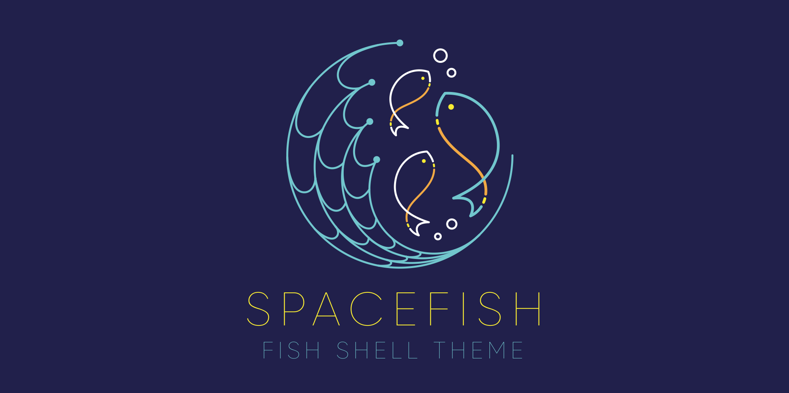

<a href="https://github.com/matchai/spacefish">
  
</a>

# 🚀🐟 Spacefish

> A [Fish Shell][fish] prompt for Astronauts.

Spacefish is a [Fish Shell][fish] port of [Spaceship][spaceship]; the minimalistic, powerful and extremely customizable [Zsh][zsh] prompt. It combines everything you may need for convenient work, without unnecessary complications, like a real spacefish.

## Preview

<p align="center">
  
</p>

## Features
* Prompt character turns red if the last command exits with non-zero code.
* Execution time of the last command if it exceeds 5 seconds.
* Current Git branch and rich repo status:
  * `?` — untracked changes;
  * `+` — uncommitted changes in the index;
  * `!` — unstaged changes;
  * `»` — renamed files;
  * `✘` — deleted files;
  * `$` — stashed changes;
  * `=` — unmerged changes;
  * `⇡` — ahead of remote branch;
  * `⇣` — behind of remote branch;
  * `⇕` — diverged chages.

### Upcoming features
* Displaying hostname/username
* Indicator if user is root
* Indicator for jobs in the background (`✦`).
* Current Node.js version, through nvm/nodenv/n (`⬢`).
* Current Ruby version, through rvm/rbenv/chruby (`💎`).
* Current Python pyenv (`🐍`).
* Package version, if there's is a package in current directory (`📦`).
* Current battery level and status:
  * `⇡` - charging;
  * `⇣` - discharging;
  * `•` - fully charged.
* Optional exit-code of last command.
* Optional time stamps 12/24hr in format.


Want more features? Please, [open an issue](https://github.com/matchai/spacefish/issues/new) or send pull request.

## Requirements
To get spacefish working correctly you will need:

* [`fish`][fish] (v2.7.0 or newer)
* [Powerline Font](https://github.com/powerline/fonts) must be installed and enabled in your terminal.

## Installation
### [Fisherman](https://fisherman.github.io)

```fish
$ fisher matchai/spacefish
```

## Customization
Spacefish works well out of the box, but you can customize almost everything if you want.

* [**Options**](./docs/Options.md) — Tweak section's behavior with tons of options.

You have ability to customize or disable specific elements of Spacefish. All options must be overridden in your `config.fish`.

[spaceship]: https://github.com/denysdovhan/spaceship-prompt
[fish]: https://fishshell.com/
[zsh]: http://zsh.org/


## License

MIT © [Matan Kushner](http://matchai.me)
