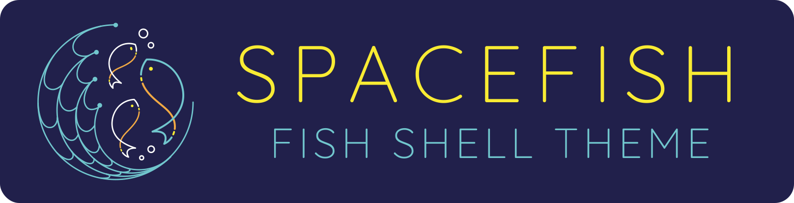

<h1 align="center">
  <a href="https://github.com/matchai/spacefish">
    
  </a>
  <br>
  <br> 🚀🐟 Spacefish <br>
</h1>

<h4 align="center">
  <a href="https://fishshell.com" target="_blank"><code>Fish Shell</code></a> prompt for Astronauts.
</h4>

<p align="center">
    <a href="https://travis-ci.org/matchai/spacefish">
    
  </a>
   <a href="https://ci.appveyor.com/project/matchai/spacefish">
    
  </a>
   <a href="https://fishshell.com/">
    
  </a>
</p>

<div align="center">
  <h4>
    <a href="https://spacefish.matchai.me/">Website</a> |
    <a href="#installation">Install</a> |
    <a href="#features">Features</a> |
    <a href="./docs/Options.md">Options</a> |
    <a href="./docs/API.md">API</a>
  </h4>
</div>

<div align="center">
  <sub>Built with ❤︎ by
  <a href="https://matchai.me">Matan Kushner</a> and
  <a href="https://github.com/matchai/spacefish/graphs/contributors">contributors </a>
</div>

<div align="center">
  <sub>A port of <a href="https://github.com/denysdovhan/spaceship-prompt">Spaceship ZSH</a>
   by
  <a href="https://denysdovhan.com/">Denys Dovhan</a>
</div>

Spacefish is a minimalistic, powerful and extremely customizable [Fish Shell][fish] prompt. It combines everything you may need for convenient work, without unnecessary complications, like a real spacefish.


<p align="center"></p>
  
</p>

<sub>Vist <a href="./docs/Troubleshooting.md#why-doesnt-my-prompt-look-like-the-preview">Troubleshooting</a> for instructions to recreate this terminal setup.</sub>

## Features

* Clever hostname and username displaying.
* Indicator if user is root.
* Prompt character turns red if the last command exits with non-zero code.
* Execution time of the last command if it exceeds 5 seconds.
* Current Node.js version, through nvm/nodenv/n (`⬢`).
* Current Ruby version, through rvm/rbenv/chruby/asdf (`💎`).
* Current Haskell version, through stack (`λ`).
* Package version, if there is a package in current directory (`📦`).
* Current Git branch and rich repo status:
  * `?` — untracked changes;
  * `+` — uncommitted changes in the index;
  * `!` — unstaged changes;
  * `»` — renamed files;
  * `✘` — deleted files;
  * `$` — stashed changes;
  * `=` — unmerged changes;
  * `⇡` — ahead of remote branch;
  * `⇣` — behind of remote branch;
  * `⇕` — diverged chages.
* Current battery level and status:
  * `⇡` - charging;
  * `⇣` - discharging;
  * `•` - fully charged.

### Upcoming features
* Indicator for jobs in the background (`✦`).
* Current Python pyenv (`🐍`).
* Optional exit-code of last command.
* Optional time stamps 12/24hr in format.

Want more features? Please [open an issue](https://github.com/matchai/spacefish/issues/new?template=Feature_request.md) or send pull request!

## Requirements
To get spacefish working correctly, you will need:

* [`fish`][fish] (v2.7.0 or newer)
* [Powerline Font](https://github.com/powerline/fonts) must be installed and enabled in your terminal.

## Installation
### [Fisherman](https://fisherman.github.io)

```fish
$ fisher matchai/spacefish
```

### [Oh My Fish!](https://github.com/oh-my-fish/oh-my-fish)

```fish
$ omf install spacefish
```

## Customization
Spacefish works really well out of the box, but you can customize your fish to your heart's content!

* [**Options**](./docs/Options.md) — Tweak section's behavior with tons of options.

You have the ability to customize or disable specific elements of Spacefish. All options must be overridden in your `config.fish`.

## Troubleshooting

Having issues? Take a look at our [Troubleshooting](./docs/Troubleshooting.md) page.

Still struggling? Please [file an issue](https://github.com/matchai/spacefish/issues/new?template=Support_question.md), describe your problem, and we will gladly help you.

## License

MIT © [Matan Kushner](http://matchai.me)

<!-- Links -->

[spaceship]: https://github.com/denysdovhan/spaceship-prompt
[fish]: https://fishshell.com/
[zsh]: http://zsh.org/
