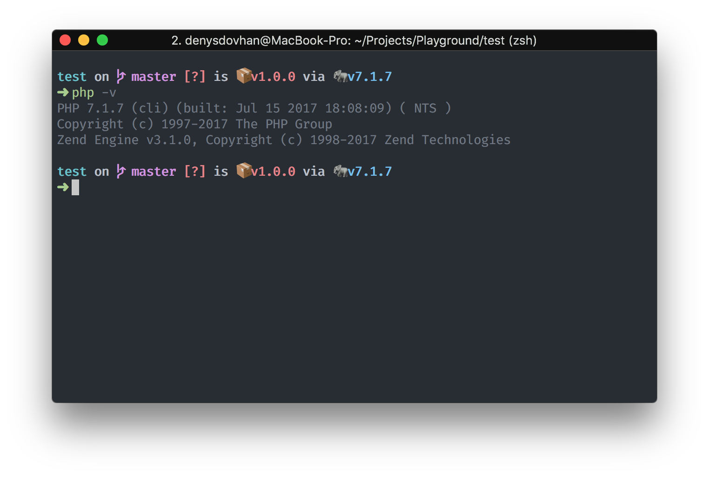

# Troubleshooting

This page aimed to help you fix common problems encountered while using spacefish.

## My prompt is filling with errors

Try all of the following troubleshooting steps:

* Verify that your fish installation is at the [latest version](https://github.com/fish-shell/fish-shell/releases)

  ```sh
  fish --version
  ```

* Update spacefish with `fisher` or `omf`

  ```sh
  fisher add matchai/spacefish
  # or
  omf update spacefish
  ```

* If errors persist, please [open an issue](https://github.com/matchai/spacefish/issues/new)

## What's the weird symbol beside the `git` branch?

You need to have a powerline patched font in order to properly display `git` branch symbol.

* Install any powerline compatible font like [Fira Code](https://github.com/tonsky/FiraCode) or [others](https://github.com/powerline/fonts).
* Configure your terminal emulator to [use that font](https://powerline.readthedocs.io/en/master/troubleshooting/osx.html).

## What's the weird character in front of a section?

This is not an issue with spacefish. Spacefish uses Unicode symbols to represent `SPACESFISH_*_SYMBOL` in sections. To solve this problem:

* Verify your terminal emulator supports Unicode characters with this command:

  ```sh
  curl https://www.cl.cam.ac.uk/~mgk25/ucs/examples/UTF-8-demo.txt
  # or
  wget -O - https://www.cl.cam.ac.uk/~mgk25/ucs/examples/UTF-8-demo.txt
  ```
* Configure your terminal emulator to use UTF-8 character encoding.


In the event that Unicode characters aren't supported, you can replace them with characters that are compatible with your terminal with `SPACEFISH_*_SYMBOL` options. Check out the [Options](./docs/Options.md) page for more information.

## Why is my prompt slow?

Spacefish may run more slowlyin big repositories since the status checks add up to be expensive operations.

To speed up your prompt, try to reduce the number of unused spacefish sections that are enabled. Spacefish only loads the sections mentioned in `SPACEFISH_PROMPT_ORDER`. If you think some sections might not be be useful to you, you can disable them by not including their names in the prompt order.

## Why do my section icons overlap each other?



This issue is due to how your terminal emulator renders Unicode 9 characters. To fix this issue:

* Make sure terminal uses _Unicode Version 9 Widths_.
* Let your terminal render ambiguous-width characters as double-width.

In _iTerm_ follow these instructions:

* Go _iTerm → Preferences… (⌘,) → Profiles → Text_
* Check _Unicode Version 9 Widths_.
* Check _Threat ambiguous-width characters as double-width_.
* Reload your terminal's tab.

## Why doesn't my prompt look like it does in the preview?


Preview shows a `spacefish` setup with:

* [Hyper](https://hyper.is) as the terminal emulator.
* [One Dark](https://www.npmjs.com/package/hyperterm-atom-dark) color theme from [Atom](https://atom.io/) editor.
* [Fira Code](https://github.com/tonsky/FiraCode) with with ligatures as primary font (16px size).

## My problem wasn't solved

If the above suggestions don't address your problem, feel free to [open an issue](https://github.com/matchai/spacefish/issues/new), describe your problem and we will gladly help you.
